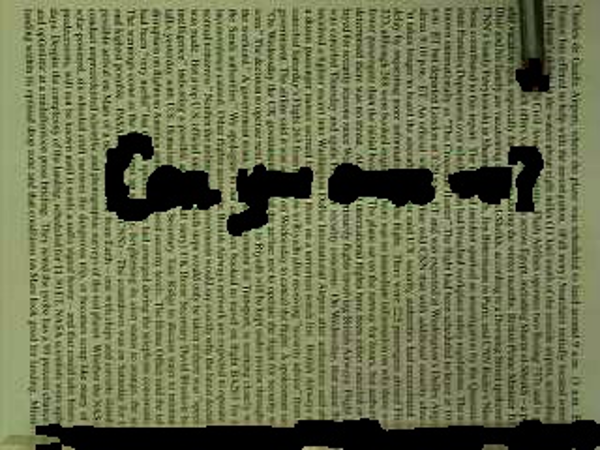

# Smart Eraser Project
Final project for EE 332: Introduction to Computer Vision, Northwestern University, Fall 2020.

## Overview
The goal of this project is to implement a program that erases several handwritten characters on a newspaper page automatically and gradually in a given video, while keeping the background texture unchanged perceptively. This is accomplished using the techniques of color segmentation (in this case "red detection"), object tracking, and texture synthesis, in that order.

## Input
The handwritten characters spell “Can you erase me?” perpendicularly to the newspaper page and act as the foreground. The background is the newspaper page but is not detailed enough to be legible.

## Output

## Algorithm
1. Read all the separate frames from the input video.
2. Use the `findRed()` function to detect the red pixels.
3. Isolate a portion of the first frame with no red pixels to use as a sample image.
4. Start image tracking by manually finding and recording position of pen.
5. Iterate through frames and do the following:
   1. Run `objectTracking()` to update position of pen.
   2. Replace pixels in new frame that were updated in previous frames.
   3. Inpaint holes at pen location using texture via synthesize() function.
   4. Save changed pixels to update with new frame.
   5. Save processed image to output list.
6. Create output video from output list.

## Intermediate Results
1. Red detection:
   
2. Object tracking:
   
   
## Dependencies
- OpenCV

## Usage Instructions
1. Import `original.avi` from Canvas.
2. Run `python3 vid2img.py` in project directory.
3. Run `python3 project.py` in project directory.
